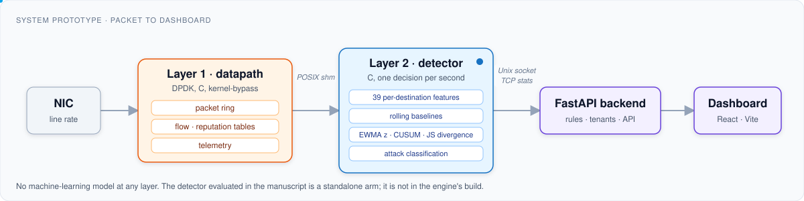
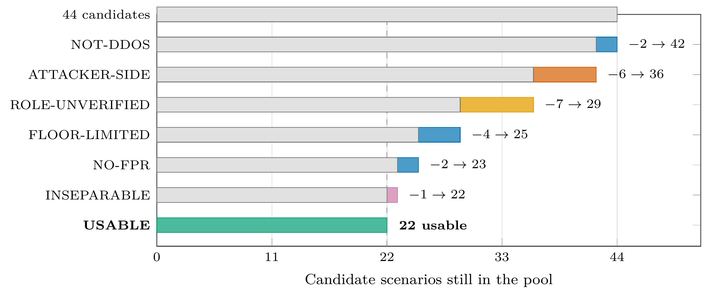
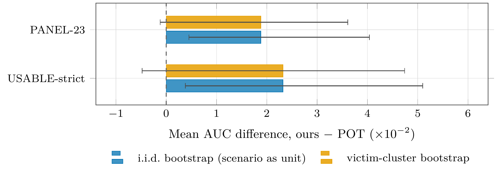
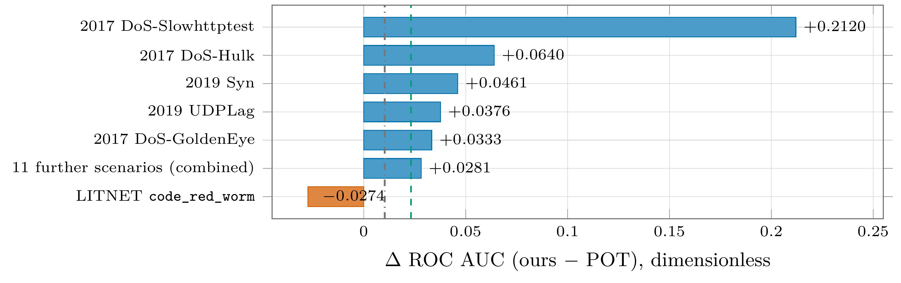
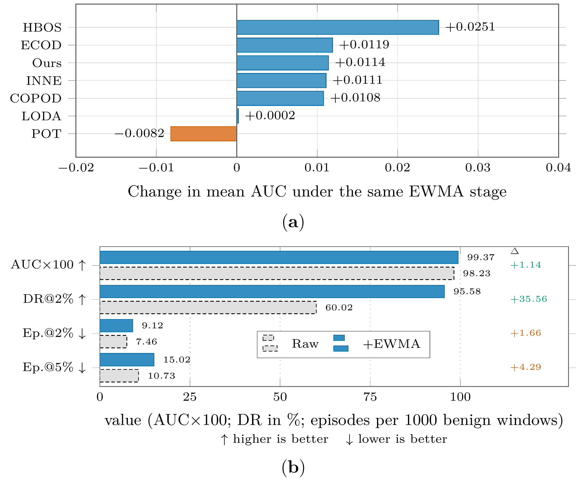
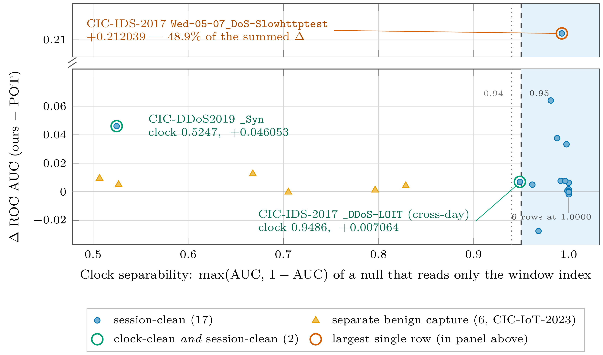
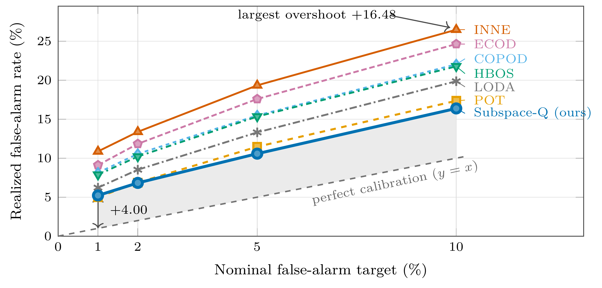

<div align="center">



<br>

[](LICENSE)
[](ComparisonResults/)
[](datasets/README.md)
[](project/)
[](project/dashboard)

**Reported DDoS-detector performance rests on evaluation choices that are rarely audited.<br>This repository holds the protocol that audits them, the records it produced, and the prototype it was run against.**

</div>

<br>

## What applying the protocol changed

Three decisions decide what a benchmark can evidence: which victim–scenario slices are admissible,
whether a library baseline scores a row independently of the batch it arrives in, and what the
unit of statistical analysis is. The manuscript *An Evaluation Protocol for Training-Free DDoS
Detection* (MDPI *Journal of Cybersecurity and Privacy*, in preparation) fixes all three and
applies them end to end to six public corpora. The contribution is the protocol and the
measurement of what it costs — not a new detector.



## How the system is built

A DPDK packet datapath in C, a statistical detector in C that decides once per second, and a
web control plane. No machine-learning model anywhere.



## What the evaluation found

Every figure below is drawn from the deposited records in [`ComparisonResults/results/`](ComparisonResults/results/).
Click any figure for the full-resolution image.

<table>
<tr>
<td width="50%" align="center">
<a href="assets/figures/fig1-admissibility-funnel.png"></a><br>
<sub><b>Half the candidate scenarios never reach evaluation.</b> 44 candidates, one recorded verdict each, 22 admitted.</sub>
</td>
<td width="50%" align="center">
<a href="assets/figures/fig2-victim-clustered-intervals.png"></a><br>
<sub><b>The unit of analysis changes the sign of a conclusion.</b> The i.i.d. interval excludes zero; clustered on the victim host, it spans it.</sub>
</td>
</tr>
<tr>
<td align="center">
<a href="assets/figures/fig3-advantage-concentration.png"></a><br>
<sub><b>Five of seventeen scenarios carry the whole advantage, and one carries half of it.</b></sub>
</td>
<td align="center">
<a href="assets/figures/fig4-ewma-tradeoff.png"></a><br>
<sub><b>Smoothing is not a property of one detector.</b> Under the same EWMA stage most competitors improve too.</sub>
</td>
</tr>
<tr>
<td align="center">
<a href="assets/figures/fig5-clock-null.png"></a><br>
<sub><b>The largest advantages sit on rows that a clock-only null also separates</b> — a scorer that reads no traffic at all.</sub>
</td>
<td align="center">
<a href="assets/figures/fig6-cesnet-overshoot.png"></a><br>
<sub><b>Every arm overshoots its nominal false-alarm target, at every target,</b> on 174 real ISP hosts.</sub>
</td>
</tr>
</table>

> [!NOTE]
> Five of the six corrections ran *against* the evaluated detector, and the manuscript reports
> them as such. No victim-clustered AUC comparison of the detector against its reference reaches 5%;
> the two clustered comparisons that do, on benign-alarm episodes at the 1% and 5% targets, run against the detector.

## Verify the deposit

Every detector result and test statistic in the manuscript is read from 42 JSON records that
verify against their manifest from inside `results/`:

```bash
cd ComparisonResults/results
sha256sum -c ../SHA256SUMS.results     # 42 lines, each ending in OK
```

> [!WARNING]
> `ComparisonResults/SHA256SUMS` is an earlier manifest; several of its entries no longer match
> and it is not the manuscript's. Use `SHA256SUMS.results`.

> [!IMPORTANT]
> The deposit does not run end to end: it contains neither the six corpora nor the derived
> per-window feature tree. Two of the nineteen `runners/run_*.py` scripts —
> `run_joint_filter.py` and `run_admissibility_ledger.py` — execute from the deposited records
> alone; the other seventeen do not execute as deposited.

The per-record index and audit history are in [`ComparisonResults/README.md`](ComparisonResults/README.md);
corpus download pointers are in [`datasets/README.md`](datasets/README.md). No corpus data is committed.

## Run the prototype

<details>
<summary><b>Build the C engine</b> — Meson + Ninja, DPDK for the datapath (<a href="INSTALL.md">INSTALL.md</a>)</summary>

```bash
cd project
meson setup build -Dbuild_tests=true
ninja -C build
```

</details>

<details>
<summary><b>Run the backend</b> — FastAPI</summary>

```bash
cd project/backend
pip install -r api/requirements.txt
uvicorn api.main:app
```

</details>

<details>
<summary><b>Run the dashboard</b> — React + Vite</summary>

```bash
cd project/dashboard
npm install
npm run dev
```

</details>

<details>
<summary><b>Run the fidelity unit tests</b></summary>

```bash
python -m pytest project/tests/unit_python/
```

</details>

## Scope

- **Not a benchmark win.** The manuscript reports a negative result where the evidence is negative.
- **Not a performance claim.** `project/` is a research prototype; throughput and detection latency have not been measured.
- **Not the evaluated detector.** The arm the manuscript evaluates is in no build target of the engine; where a figure scores the shipped engine instead, the manuscript says so.
- **Not a machine-learning system.** There is no trained model at any layer.
- **Not a corpus mirror.** No dataset content is redistributed.

## Authors

| | Affiliation | |
| :-- | :-- | :-- |
| **Pulatjon Oripov** | State Institution "Cybersecurity Center", Tashkent, Uzbekistan | first author |
| **Sardor Iskandarov** | State Institution "Cybersecurity Center", Tashkent, Uzbekistan | |
| **Rustamjon Oripov** | State Institution "Cybersecurity Center", Tashkent, Uzbekistan | |
| **Dilshodjon Mamadaliev** | Cybersecurity Center · Department of Electronics Engineering, Pusan National University, Busan, Republic of Korea | corresponding · [ORCID](https://orcid.org/0009-0008-0073-7535) |

Correspondence: mamadalievdilshodjon@gmail.com

## Cite

```bibtex
@software{antiddos_shield_2026,
  title   = {AntiDDoS Shield: an evaluation protocol for training-free {DDoS} detection},
  author  = {Oripov, Pulatjon and Iskandarov, Sardor and Oripov, Rustamjon and Mamadaliev, Dilshodjon},
  year    = {2026},
  url     = {https://github.com/DilshodbekMX/AntiDDoS-Shield}
}
```

## License

Code is released under the [MIT License](LICENSE). Dataset-derived caches and results remain under
their upstream corpus licenses (CESNET-TimeSeries24, CIC-IDS-2017, CSE-CIC-IDS2018, CIC-DDoS2019,
CIC-IoT-2023, LITNET-2020); consult each dataset's terms before redistributing anything derived
from it.
