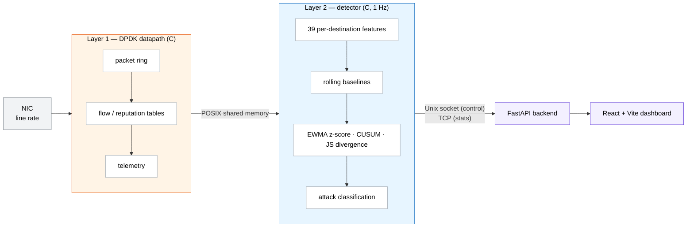

<div align="center">

# AntiDDoS Shield

**An evaluation protocol for training-free DDoS detection, with the reference prototype it was measured against.**

[](LICENSE)
[](ComparisonResults/)
[](datasets/README.md)
[](project/)
[](project/dashboard)

</div>

## Contents

1. [Overview](#overview)
2. [Authors](#authors)
3. [Repository structure](#repository-structure)
4. [Evaluation deposit](#evaluation-deposit)
5. [System prototype](#system-prototype)
6. [Getting started](#getting-started)
7. [Scope and limitations](#scope-and-limitations)
8. [Citing this work](#citing-this-work)
9. [License](#license)

## Overview

Reported DDoS-detector performance rests on evaluation choices that are rarely audited: which
victim–scenario slices of a corpus are admissible, whether a library baseline scores a row
independently of the batch it arrives in, and what the unit of statistical analysis is. This
repository accompanies the manuscript *An Evaluation Protocol for Training-Free DDoS Detection*,
prepared for the MDPI *Journal of Cybersecurity and Privacy*, which specifies a corrected protocol
for these three decisions and applies it end to end to six public corpora.

The contribution is the protocol and the measurement of what it costs, not a new detector. The
table below summarises the effect of each correction on the reported picture; the direction of
every correction, including the five that ran against the evaluated detector, is recorded in the
deposit.

| Stage | Correction | Effect on the reported picture |
| :-- | :-- | :-- |
| Admissibility | A scope filter and four checks, one recorded verdict per candidate | 44 candidate victim–scenario slices reduced to 22 admissible |
| Scoring | Library baselines rescored inductively, so attack rows cannot enter their own reference distribution | Competitor mean AUC rises by 0.24 to 0.44; batch-invariant arms move by exactly 0 |
| Unit of analysis | Clustering on the victim host rather than the scenario | An interval that excluded zero becomes one that spans it |

## Authors

| Author | Affiliation | Role |
| :-- | :-- | :-- |
| Pulatjon Oripov | State Institution "Cybersecurity Center", Tashkent, Uzbekistan | First author |
| Sardor Iskandarov | State Institution "Cybersecurity Center", Tashkent, Uzbekistan | Co-author |
| Rustamjon Oripov | State Institution "Cybersecurity Center", Tashkent, Uzbekistan | Co-author |
| Dilshodjon Mamadaliev | State Institution "Cybersecurity Center", Tashkent, Uzbekistan · Department of Electronics Engineering, Pusan National University, Busan, Republic of Korea | Corresponding author · [ORCID 0009-0008-0073-7535](https://orcid.org/0009-0008-0073-7535) |

Correspondence: mamadalievdilshodjon@gmail.com

## Repository structure

```
.
├── ComparisonResults/     Evaluation deposit: runners, baseline registry, 42 result records
│   ├── runners/           17 run_*.py scripts; two execute from the deposited records alone
│   ├── results/           JSON result records, verified by SHA256SUMS.results
│   └── README.md          Per-record index and audit history
├── project/               System prototype: DPDK datapath, C detector, FastAPI backend, dashboard
├── datasets/README.md     Download pointers for the six corpora (no data is committed)
├── INSTALL.md             Build and deployment instructions for the prototype
└── LICENSE                MIT
```

| Path | Status |
| :-- | :-- |
| `ComparisonResults/` | The deposit under review |
| `project/` | Context for the manuscript's engine figures; not an evaluated contribution |
| `datasets/` | Pointers only |

## Evaluation deposit

Every detector result and test statistic in the manuscript is read from the 42 JSON records in
[`ComparisonResults/results/`](ComparisonResults/results/). The records carry a manifest that
verifies from inside that directory:

```bash
cd ComparisonResults/results
sha256sum -c ../SHA256SUMS.results     # 42 lines, each ending in OK
```

> [!WARNING]
> `ComparisonResults/SHA256SUMS` is an earlier manifest of code and records. Several of its
> entries no longer match, and it is not the manuscript's manifest. Use `SHA256SUMS.results`.

> [!IMPORTANT]
> The deposit does not execute end to end. It contains neither the six corpora nor the derived
> per-window feature tree the runners read. Two of the seventeen `runners/run_*.py` scripts,
> `run_joint_filter.py` and `run_admissibility_ledger.py`, execute from the deposited records
> alone; the other fifteen do not execute as deposited.

The per-record index, the baseline registry, and the audit history are documented in
[`ComparisonResults/README.md`](ComparisonResults/README.md).

## System prototype

[`project/`](project/) holds the AntiDDoS Shield system: a DPDK packet datapath in C, a 1 Hz
statistical anomaly detector in C, a FastAPI backend, and a React dashboard. No machine-learning
model is present at any layer. It is supplied as context for the manuscript's engine figures; the
arm the manuscript evaluates is in no build target of the engine.



## Getting started

**Requirements.** A Linux host with DPDK for the datapath, Meson and Ninja, Python 3, and
Node.js for the dashboard. Full prerequisites are in [`INSTALL.md`](INSTALL.md).

<details>
<summary><b>Build the C engine</b></summary>

```bash
cd project
meson setup build -Dbuild_tests=true
ninja -C build
```

</details>

<details>
<summary><b>Run the backend</b></summary>

```bash
cd project/backend
pip install -r api/requirements.txt
uvicorn api.main:app
```

</details>

<details>
<summary><b>Run the dashboard</b></summary>

```bash
cd project/dashboard
npm install
npm run dev
```

</details>

<details>
<summary><b>Run the fidelity unit tests</b></summary>

```bash
python -m pytest project/tests/unit_python/
```

</details>

<details>
<summary><b>Inspect the evaluation deposit</b></summary>

Begin with [`ComparisonResults/README.md`](ComparisonResults/README.md), then
[`datasets/README.md`](datasets/README.md) for how to obtain the corpora.

</details>

## Scope and limitations

- **Findings.** The manuscript reports a negative result where the evidence is negative. No
  victim-clustered comparison of the evaluated detector against its reference reaches the 5% level.
- **Performance.** `project/` is a research prototype. Its throughput and detection latency have
  not been measured, and no line-rate figure is claimed.
- **Evaluated arm.** The detector the manuscript evaluates is not part of the engine's build.
  Where a figure scores the shipped engine instead, the manuscript identifies it.
- **Models.** There is no trained model at any layer.
- **Data.** No corpus content is redistributed; see [`datasets/README.md`](datasets/README.md).

## Citing this work

The manuscript is in preparation for the MDPI *Journal of Cybersecurity and Privacy*. Until it
appears, please cite the repository:

```bibtex
@software{antiddos_shield_2026,
  title   = {AntiDDoS Shield: an evaluation protocol for training-free {DDoS} detection},
  author  = {Oripov, Pulatjon and Iskandarov, Sardor and Oripov, Rustamjon and Mamadaliev, Dilshodjon},
  year    = {2026},
  url     = {https://github.com/DilshodbekMX/AntiDDoS-Shield}
}
```

## License

Code is released under the [MIT License](LICENSE). Dataset-derived caches and results remain
under their upstream corpus licenses (CESNET-TimeSeries24, CIC-IDS-2017, CSE-CIC-IDS2018,
CIC-DDoS2019, CIC-IoT-2023, LITNET-2020); consult each dataset's terms before redistributing
anything derived from it.
