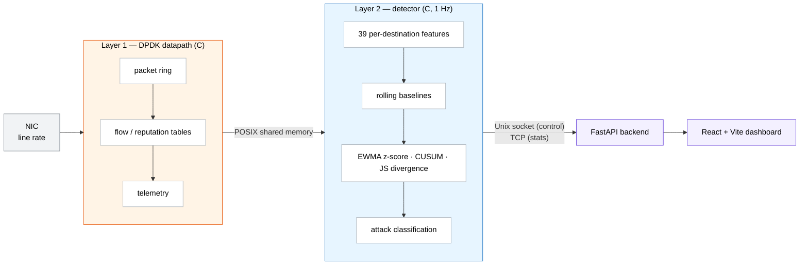

<div align="center">

# AntiDDoS Shield

**An evaluation protocol for training-free DDoS detection — and the prototype it was measured against.**

[](LICENSE)
[](ComparisonResults/)
[](datasets/README.md)
[](project/)
[](project/dashboard)

</div>

---

Reported DDoS-detector performance rests on evaluation choices that are rarely audited. This
repository holds the deposit for a manuscript that specifies a corrected evaluation protocol —
scenario admissibility, batch-invariant scoring, and clustering on the victim host — and applies it
end to end to six public corpora. **The contribution is the protocol and the measurement of what it
costs, not a new detector.**

### What applying the protocol changed

| Stage | Correction | Effect on the reported picture |
| :-- | :-- | :-- |
| **Admissibility** | A scope filter and four checks, one recorded verdict per candidate | 44 candidate victim–scenario slices → **22** admissible |
| **Scoring** | Rescore library baselines inductively, so attack rows cannot enter their own reference distribution | Competitor mean AUC **+0.24 to +0.44**; batch-invariant arms move by exactly **0** |
| **Unit of analysis** | Cluster on the victim host, not the scenario | An interval that **excluded zero** becomes one that **spans it** |

> [!NOTE]
> Five of the corrections ran *against* the evaluated detector and one ran in its favour. The
> direction of every correction is recorded in the deposit. Direction was not a criterion for
> reporting.

---

## Repository layout

Three things with three different statuses.

| Path | What it is | Status |
| :-- | :-- | :-- |
| [`ComparisonResults/`](ComparisonResults/) | Evaluation runners, baseline registry, and the 42 JSON result records the manuscript reads | **Under review** — the deposit |
| [`project/`](project/) | The AntiDDoS Shield system: DPDK datapath, C detector, FastAPI backend, React dashboard | **Context only** — not an evaluated contribution |
| [`datasets/`](datasets/README.md) | Download pointers for the six public corpora | **Pointers only** — no corpus data is committed |

---

## The evaluation deposit

[`ComparisonResults/`](ComparisonResults/) backs the manuscript *An Evaluation Protocol for
Training-Free DDoS Detection*, prepared for the MDPI *Journal of Cybersecurity and Privacy*. Every
detector result and test statistic in the manuscript is read from these records.

**Verify the records against their manifest**, from inside `results/`:

```bash
cd ComparisonResults/results
sha256sum -c ../SHA256SUMS.results     # 42 lines, each ending in OK
```

> [!WARNING]
> `ComparisonResults/SHA256SUMS` is an **earlier** manifest of code and records. Several of its
> entries no longer match, and it is *not* the manuscript's manifest. Use `SHA256SUMS.results`.

> [!IMPORTANT]
> **The deposit does not run end to end.** It contains neither the six corpora nor the derived
> per-window feature tree the runners read. Two of the seventeen `runners/run_*.py` scripts —
> `run_joint_filter.py` and `run_admissibility_ledger.py` — execute from the deposited records
> alone; the other fifteen do not execute as deposited.

See [`ComparisonResults/README.md`](ComparisonResults/README.md) for the per-record index and the
audit history.

---

## Architecture

A DPDK packet datapath in C, a 1 Hz statistical anomaly detector in C, and a web control plane.
No machine-learning model is present at any layer.



---

## Quick start

<details>
<summary><b>1 · Build the C engine</b></summary>

```bash
cd project
meson setup build -Dbuild_tests=true
ninja -C build
```

Full prerequisites and DPDK setup are in [`INSTALL.md`](INSTALL.md).

</details>

<details>
<summary><b>2 · Run the backend</b></summary>

```bash
cd project/backend
pip install -r api/requirements.txt
uvicorn api.main:app
```

</details>

<details>
<summary><b>3 · Run the dashboard</b></summary>

```bash
cd project/dashboard
npm install
npm run dev
```

</details>

<details>
<summary><b>4 · Run the fidelity unit tests</b></summary>

```bash
python -m pytest project/tests/unit_python/
```

</details>

<details>
<summary><b>5 · Inspect the evaluation deposit</b></summary>

Start with [`ComparisonResults/README.md`](ComparisonResults/README.md), then
[`datasets/README.md`](datasets/README.md) for how to obtain the corpora.

</details>

---

## What this repository is not

Stated plainly, because each of these has been mistaken for a claim before.

- **Not a benchmark win.** The manuscript reports a negative result where the evidence is negative.
  No victim-clustered comparison of the evaluated detector against its reference reaches 5%.
- **Not a performance claim.** `project/` is a research prototype. Its throughput and detection
  latency have **not** been measured, and no line-rate figure is claimed anywhere.
- **Not the evaluated detector.** The arm the manuscript evaluates is in no build target of the
  engine. Where a figure scores the shipped engine instead, the manuscript says so.
- **Not a machine-learning system.** There is no trained model, at any layer.
- **Not a corpus mirror.** No dataset content is redistributed here.

---

## Citation

The manuscript is in preparation for the MDPI *Journal of Cybersecurity and Privacy*. Until it
appears, please cite this repository:

```bibtex
@software{antiddos_shield,
  title  = {AntiDDoS Shield: an evaluation protocol for training-free DDoS detection},
  author = {Oripov, Pulatjon, Mamadaliev, Dilshodjon, Iskandarov Sardor and Oripov Rustamjon},
  year   = {2026},
  url    = {https://github.com/DilshodbekMX/AntiDDoS-Shield}
}
```

---

## License

Code is released under the [MIT License](LICENSE). Dataset-derived caches and results remain under
their upstream corpus licenses — CESNET-TimeSeries24, CIC-IDS-2017, CSE-CIC-IDS2018, CIC-DDoS2019,
CIC-IoT-2023 and LITNET-2020. See each dataset's terms before redistributing anything derived from
it.
